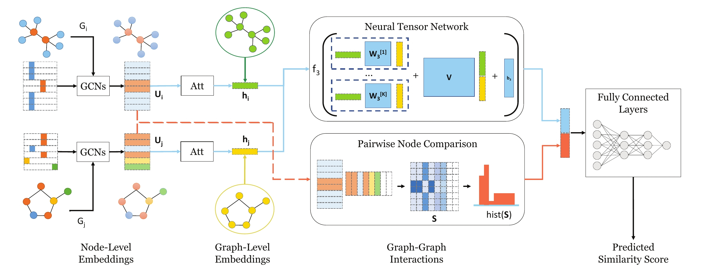
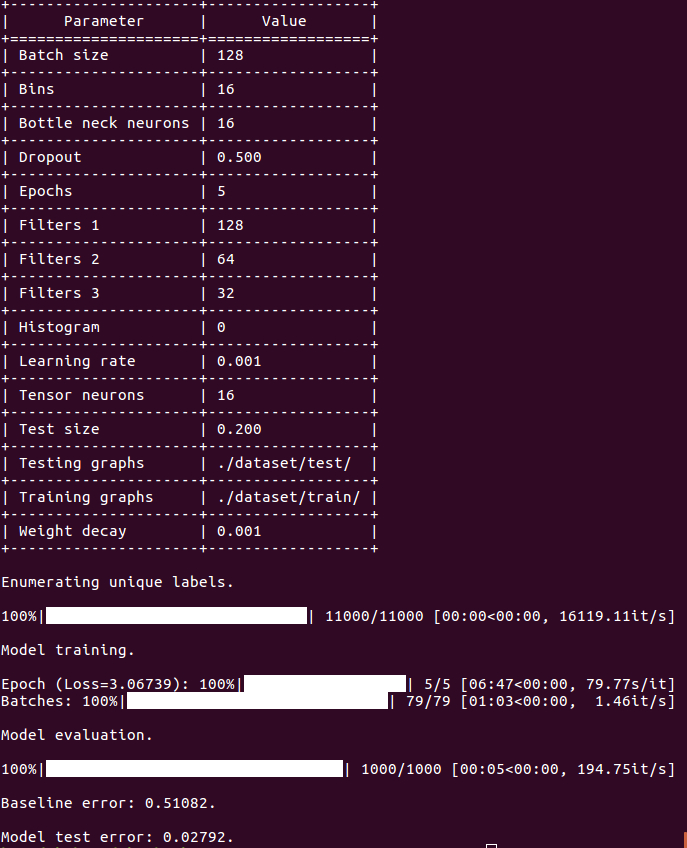

SimGNN
=======================
[](https://paperswithcode.com/sota/graph-similarity-on-imdb?p=graph-edit-distance-computation-via-graph) [](https://codebeat.co/projects/github-com-benedekrozemberczki-simgnn-master) [](https://github.com/benedekrozemberczki/SimGNN/archive/master.zip)⠀[](https://twitter.com/intent/follow?screen_name=benrozemberczki)⠀⠀


 
A **PyTorch** implementation of *SimGNN: A Neural Network Approach to Fast Graph Similarity Computation (WSDM 2019)*. 
<p align="center">
  
</p>
	
### Abstract
<p align="justify">
Graph similarity search is among the most important graph-based applications, e.g. finding the chemical compounds that are most similar to a query compound. Graph similarity/distance computation, such as Graph Edit Distance (GED) and Maximum Common Subgraph (MCS), is the core operation of graph similarity search and many other applications, but very costly to compute in practice. Inspired by the recent success of neural network approaches to several graph applications, such as node or graph classification, we propose a novel neural network based approach to address this classic yet challenging graph problem, aiming to alleviate the computational burden while preserving a good performance. The proposed approach, called SimGNN, combines two strategies. First, we design a learnable embedding function that maps every graph into an embedding vector, which provides a global summary of a graph. A novel attention mechanism is proposed to emphasize the important nodes with respect to a specific similarity metric. Second, we design a pairwise node comparison method to sup plement the graph-level embeddings with fine-grained node-level information. Our model achieves better generalization on unseen graphs, and in the worst case runs in quadratic time with respect to the number of nodes in two graphs. Taking GED computation as an example, experimental results on three real graph datasets demonstrate the effectiveness and efficiency of our approach. Specifically, our model achieves smaller error rate and great time reduction compared against a series of baselines, including several approximation algorithms on GED computation, and many existing graph neural network based models. Our study suggests SimGNN provides a new direction for future research on graph similarity computation and graph similarity search.</p>

This repository provides a PyTorch implementation of SimGNN as described in the paper:

> SimGNN: A Neural Network Approach to Fast Graph Similarity Computation.
> Yunsheng Bai, Hao Ding, Song Bian, Ting Chen, Yizhou Sun, Wei Wang.
> WSDM, 2019.
> [[Paper]](http://web.cs.ucla.edu/~yzsun/papers/2019_WSDM_SimGNN.pdf)

A reference Tensorflow implementation is accessible [[here]](https://github.com/yunshengb/SimGNN) and another implementation is [[here]](https://github.com/NightlyJourney/SimGNN).

### Requirements
The codebase is implemented in Python 3.5.2. package versions used for development are just below.
```
networkx          2.4
tqdm              4.28.1
numpy             1.15.4
pandas            0.23.4
texttable         1.5.0
scipy             1.1.0
argparse          1.1.0
torch             1.1.0
torch-scatter     1.4.0
torch-sparse      0.4.3
torch-cluster     1.4.5
torch-geometric   1.3.2
torchvision       0.3.0
scikit-learn      0.20.0
```
### Datasets
<p align="justify">
The code takes pairs of graphs for training from an input folder where each pair of graph is stored as a JSON. Pairs of graphs used for testing are also stored as JSON files. Every node id and node label has to be indexed from 0. Keys of dictionaries are stored strings in order to make JSON serialization possible.</p>

Every JSON file has the following key-value structure:

```javascript
{"graph_1": [[0, 1], [1, 2], [2, 3], [3, 4]],
 "graph_2":  [[0, 1], [1, 2], [1, 3], [3, 4], [2, 4]],
 "labels_1": [2, 2, 2, 2, 2],
 "labels_2": [2, 3, 2, 2, 2],
 "ged": 1}
```
<p align="justify">
The **graph_1** and **graph_2** keys have edge list values which descibe the connectivity structure. Similarly, the **labels_1**  and **labels_2** keys have labels for each node which are stored as list - positions in the list correspond to node identifiers. The **ged** key has an integer value which is the raw graph edit distance for the pair of graphs.</p>

### Options
<p align="justify">
Training a SimGNN model is handled by the `src/main.py` script which provides the following command line arguments.</p>

#### Input and output options
```
  --training-graphs   STR    Training graphs folder.      Default is `dataset/train/`.
  --testing-graphs    STR    Testing graphs folder.       Default is `dataset/test/`.
```
#### Model options
```
  --filters-1             INT         Number of filter in 1st GCN layer.       Default is 128.
  --filters-2             INT         Number of filter in 2nd GCN layer.       Default is 64. 
  --filters-3             INT         Number of filter in 3rd GCN layer.       Default is 32.
  --tensor-neurons        INT         Neurons in tensor network layer.         Default is 16.
  --bottle-neck-neurons   INT         Bottle neck layer neurons.               Default is 16.
  --bins                  INT         Number of histogram bins.                Default is 16.
  --batch-size            INT         Number of pairs processed per batch.     Default is 128. 
  --epochs                INT         Number of SimGNN training epochs.        Default is 5.
  --dropout               FLOAT       Dropout rate.                            Default is 0.5.
  --learning-rate         FLOAT       Learning rate.                           Default is 0.001.
  --weight-decay          FLOAT       Weight decay.                            Default is 10^-5.
  --histogram             BOOL        Include histogram features.              Default is False.
```
### Examples
<p align="justify">
The following commands learn a neural network and score on the test set. Training a SimGNN model on the default dataset.</p>

```
python src/main.py
```
<p align="center">

</p>

Training a SimGNN model for a 100 epochs with a batch size of 512.
```
python src/main.py --epochs 100 --batch-size 512
```
Training a SimGNN with histogram features.
```
python src/main.py --histogram
```
Training a SimGNN with histogram features and a large bin number.
```
python src/main.py --histogram --bins 32
```
Increasing the learning rate and the dropout.
```
python src/main.py --learning-rate 0.01 --dropout 0.9
```
You can save the trained model by adding the `--save-path` parameter.
```
python src/main.py --save-path /path/to/model-name
```
Then you can load a pretrained model using the `--load-path` parameter; **note that the model will be used as-is, no training will be performed**.
```
python src/main.py --load-path /path/to/model-name
```
----------------------------------------------------------------------

**License**

- [GNU](https://github.com/benedekrozemberczki/SimGNN/blob/master/LICENSE)
